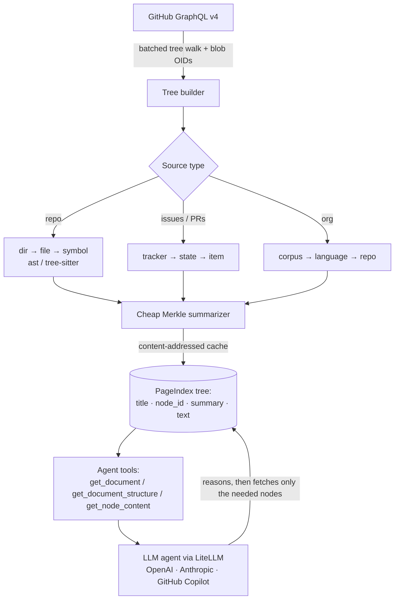

# 🐙 GitIndex — Vectorless Repo Intelligence (built on PageIndex)

> **This repository = PageIndex (base engine) + GitIndex (new feature built on top).**
>
> [**PageIndex**](https://github.com/VectifyAI/PageIndex) — documented in full below — is the base code: it turns a **document** into a reasoning-friendly **tree** and lets an LLM agent navigate it, with **no vectors and no chunking**. **GitIndex** is a feature built on that *same* architecture, but pointed at **GitHub** instead of PDFs. It indexes **entire repositories (code), issues & PRs, and whole orgs (100+ repos)** into the same kind of tree, then lets an agent reason over it to answer questions.

GitIndex reuses PageIndex's retrieval contract verbatim — a tree of `{title, node_id, summary, …}` nodes plus the agent tools `get_document`, `get_document_structure`, and `get_node_content`. Only the **tree-building** and **content-addressing** layers are GitHub-specific; the reasoning/retrieval layer is unchanged from PageIndex.

### What GitIndex indexes

| Source | Tree shape | Example question |
|---|---|---|
| **Repo (code)** | `dir → file → symbol` (functions / classes / methods) | *"Where is the entry point? How does auth work?"* |
| **Issues & PRs** | `tracker → state → item` (title + body + comments) | *"What open bugs mention retries?"* |
| **Org / user** | `corpus → language → repo` (lazy, scales to 100+ repos) | *"Which repos touch the payment service?"* |

### 🤔 RAG vs. GitIndex — what's the difference?

Traditional code RAG **splits files into fixed chunks, embeds them, and runs similarity search** — discarding the one thing code has in abundance: **structure**. GitIndex keeps the structure and **reasons** over it.

| | Vector RAG (typical) | **GitIndex (vectorless)** |
|---|---|---|
| Retrieval unit | Fixed-size text chunks | Real code units: dir / file / **symbol** |
| Index | Embeddings in a vector DB | **Hierarchical tree** of cheap summaries |
| Retrieval method | Top-k cosine similarity | **Agent reasoning** + tree search |
| Notion of "relevance" | Similarity (an approximation) | Traceable node selection, with reasons |
| Updates | Re-embed changed chunks | **Merkle diff** on git blob OIDs |
| Cross-file questions | Hard (chunks are isolated) | Native (the agent walks the tree) |
| Cost at scale | Store + query every vector | Summaries **de-duplicated by content hash** |

> **similarity ≠ relevance.** For code, what's *relevant* depends on call graphs, file layout, and intent — which needs **reasoning over structure**, not nearest-neighbor vectors. This is the PageIndex thesis, applied to repositories.

### 🏗️ Architecture



**The cheap-summarization trick (think like a DSA programmer).** Summarizing every file across 100+ repos with an LLM would be slow and expensive. GitIndex treats git as the **Merkle tree it already is**: every file's blob **OID is a content hash**, so summaries are **content-addressed and de-duplicated** across all repos. Four tiers keep cost near-zero:

1. **Tier 0 — extractive (no LLM):** signatures, docstrings, README headers, issue titles.
2. **Tier 1 — memoized:** an OID → summary cache, so identical files are summarized once, ever.
3. **Tier 2 — batched LLM:** leftover leaves are bin-packed into a few cheap calls.
4. **Tier 3 — bottom-up reduction:** parent summaries are composed from their children.

**Incremental refresh** is just a Merkle diff: only files whose **blob OID changed** are re-fetched, re-parsed, and re-summarized.

### ⚙️ Setup

```bash
# 1) Install PageIndex deps + the agent runtime
pip3 install -r requirements.txt
pip3 install "openai-agents[litellm]"

# 2) A read-only GitHub token for the GraphQL API
export GITHUB_TOKEN=ghp_xxx          # or GH_TOKEN

# 3) Choose your LLM in pageindex/config.yaml (everything is routed via LiteLLM):
#    model: "gpt-4o-2024-11-20"                # OpenAI         → needs OPENAI_API_KEY
#    model: "github_copilot/claude-opus-4.8"   # GitHub Copilot → device login, no API key
#    model: "anthropic/claude-sonnet-4-6"      # Anthropic      → needs ANTHROPIC_API_KEY
```

`GITHUB_TOKEN` powers fetching (GraphQL); the configured `model` powers summaries and the agent. With a **GitHub Copilot** model, LiteLLM performs a one-time `github.com/login/device` and caches the token — no separate API key required.

### 🚀 Usage

**Python API**

```python
from pageindex import PageIndexClient

client = PageIndexClient(workspace="examples/workspace")
doc_id = client.index_github("owner/name")                       # auto: repo or org
# client.index_github("owner/name", mode="tracker", include="both")  # issues + PRs
# client.index_github("some-org", mode="org")                        # 100+ repos

client.refresh(doc_id)                                # incremental Merkle update
print(client.get_document_structure(doc_id))          # the tree (titles + summaries)
print(client.get_node_content(doc_id, "0007,0012"))   # code/text for specific nodes
```

**Agent CLI demo**

```bash
MODE=repo REPO=owner/name QUESTION="What does this repo do?" \
  python3 examples/github_vectorless_rag_demo.py
```

**Chat UI (ChatGPT-style)**

```bash
GITHUB_TOKEN=$GITHUB_TOKEN python3 webapp/server.py    # → http://127.0.0.1:8000
```

Type `owner/name`, click **Index**, then chat. Answers stream token-by-token with the agent's tool calls shown as chips, and responses come **only** from the indexed tree (traceable).

### 🧩 Where the GitIndex code lives

| Module | Role |
|---|---|
| `pageindex/sources/github_graphql.py` | Batched GitHub GraphQL client (tree walk, blobs, issues/PRs, org repos) |
| `pageindex/sources/code_parser.py` | Symbol extraction (Python `ast`; optional tree-sitter for other languages) |
| `pageindex/summarize.py` | Cheap Merkle summarizer + content-addressed summary cache |
| `pageindex/sources/github_repo.py`, `github_issues.py`, `github_org.py` | The three tree builders (repo / tracker / org) |
| `pageindex/retrieve.py`, `pageindex/client.py` | `get_node_content`, `index_github*()`, `refresh()` |
| `examples/github_vectorless_rag_demo.py` | Agent CLI demo |
| `webapp/` | Starlette backend + ChatGPT-style chat UI |

> The rest of this README documents **PageIndex**, the base engine GitIndex is built on.

---
